<!--
  Profile README for github.com/JSchOBL — palette and type taken from
  johannes-schieder.com (src/styles/colors.ts).

  Regenerating the artwork:
    python3 scripts/generate_decor.py   # section headers + buttons (static)
    python3 scripts/generate_stats.py   # stats.svg + langs.svg (live data)

  The stat cards refresh themselves daily via .github/workflows/stats.yml, and
  the contribution snake is rebuilt every 12h by .github/workflows/snake.yml.

  GitHub caches images aggressively: after changing an SVG, a hard refresh or a
  few minutes' wait may be needed before the new version shows up.
-->

<div align="center">
  
</div>

<div align="center">
  <a href="https://johannes-schieder.com"></a>
  <a href="https://www.linkedin.com/in/johannes-schieder-2408b5349/"></a>
  <a href="https://www.instagram.com/schieder.jns/"></a>
</div>

<div align="center">
  <sub>
    <a href="#about">About</a> &nbsp;·&nbsp;
    <a href="#experience">Experience</a> &nbsp;·&nbsp;
    <a href="#projects">Projects</a> &nbsp;·&nbsp;
    <a href="#stats">Stats</a> &nbsp;·&nbsp;
    <a href="#contact">Contact</a>
  </sub>
</div>

<br>

<a name="about"></a>


I'm a backend engineer who cares about the unglamorous parts: the service that stays up, the pipeline that doesn't quietly drop rows, and the architecture you can still explain a year later.

Right now I'm a dual student in **Industry 4.0-Informatics** at **BHS Corrugated**, rotating through frontend, backend and data engineering teams — which means the things I build tend to end up on an actual factory floor rather than in a slide deck.

```yaml
location:      Weiherhammer, Bavaria 🇩🇪
studying:      Industry 4.0-Informatics — dual programme, since 2023
working:       BHS Corrugated — backend · cloud · data engineering
learning:      agentic AI workflows, distributed systems
ask_me_about:  [ Spring Boot, AWS, IoT data pipelines, clean architecture ]
```

**A few technologies I've been working with recently:**

<table>
  <tr>
    <td align="right" width="150"><sub><b>LANGUAGES</b></sub></td>
    <td>
      
      
      
      
      
    </td>
  </tr>
  <tr>
    <td align="right"><sub><b>BACKEND &amp; DATA</b></sub></td>
    <td>
      
      
      
      
      
      
    </td>
  </tr>
  <tr>
    <td align="right"><sub><b>CLOUD &amp; TOOLING</b></sub></td>
    <td>
      
      
      
      
      
    </td>
  </tr>
  <tr>
    <td align="right"><sub><b>IOT &amp; EMBEDDED</b></sub></td>
    <td>
      
      
      
      
    </td>
  </tr>
</table>

<!-- Personalise freely — this section is meant to sound like you, not like a CV. -->
<details>
  <summary><b>&nbsp;Beyond the terminal</b></summary>
  <br>

- 🏭 &nbsp;I like problems that have a physical side to them — sensors, factory lines, things that break in ways a unit test never predicted.
- 📈 &nbsp;I got into Python properly by analysing market data, which is still my favourite excuse to try a new library.
- 🛠️ &nbsp;My own website runs on S3 and ships through GitHub Actions, because the fastest way to learn infra is to be your own on-call.
- ☕ &nbsp;Best debugging tool I own is a walk around the Oberpfalz countryside.

</details>

<br>

<a name="experience"></a>


<table>
  <tr>
    <td width="170" valign="top"><br><sub><b>2023 — PRESENT</b></sub></td>
    <td valign="top">
      <br>
      <b>Dual Student, Industry 4.0-Informatics</b><br>
      <a href="https://www.bhs-world.com/unternehmen">BHS Corrugated Maschinen- und Anlagenbau GmbH</a>
      <br><br>
      Studying computer science while working across development teams at one of the
      world's leading manufacturers of corrugated cardboard production lines. Hands-on
      work spanning frontend, backend and data engineering — from Spring Boot
      microservices and AWS infrastructure to the pipelines that make machine data
      usable.
      <br><br>
      
      
      
      
      
      
      
      
      
    </td>
  </tr>
</table>

<br>

<a name="projects"></a>


<table>
  <tr>
    <td width="50%" valign="top">
      <h3>▹ <a href="https://github.com/JSchOBL/Sensiq">Sensiq</a></h3>
      <p>End-to-end serverless IoT platform for environmental monitoring. ESP32 sensor
      nodes feed an AWS backend, and a React frontend turns the stream into real-time
      and historical analysis.</p>
      <p>
        
        
        
        
      </p>
    </td>
    <td width="50%" valign="top">
      <h3>▹ <a href="https://github.com/JSchOBL/BiteBound">BiteBound</a></h3>
      <p>A tilt-controlled IoT game on the ESP32-S3, with real-time physics and two
      dashboards — an Android app and a Node-RED flow — kept in sync over MQTT.</p>
      <p>
        
        
        
        
      </p>
    </td>
  </tr>
  <tr>
    <td width="50%" valign="top">
      <h3>▹ <a href="https://github.com/JSchOBL/Financial-Data-Analytics">Financial Data Analytics</a></h3>
      <p>Collecting, cleaning and visualising market data in Python to dig into stock
      market trends — the project that turned pandas and scikit-learn into everyday
      tools for me.</p>
      <p>
        
        
        
        
      </p>
    </td>
    <td width="50%" valign="top">
      <h3>▹ <a href="https://github.com/JSchOBL/agentic-ai-learning-journey">Agentic AI Learning Journey</a></h3>
      <p>A hands-on lab for writing good agent context: you write the <code>CLAUDE.md</code>,
      the agent builds the code, and a coach reviews how well you briefed it.</p>
      <p>
        
        
        
      </p>
    </td>
  </tr>
</table>

<div align="center">
  <a href="https://github.com/JSchOBL?tab=repositories"></a>
</div>

<br>

<a name="stats"></a>


<div align="center">
  
  
</div>

<div align="center">
  
</div>

<details>
  <summary><b>&nbsp;Contribution graph</b></summary>
  <br>
  
</details>

<br>

<a name="contact"></a>


My inbox is open — whether you have a question, a project in mind, or just want to
say hello, I'll do my best to get back to you.

<div align="center">
  <br>
  <a href="https://johannes-schieder.com"></a>
  <a href="https://www.linkedin.com/in/johannes-schieder-2408b5349/"></a>
  <a href="https://www.instagram.com/schieder.jns/"></a>
  <a href="https://github.com/JSchOBL"></a>
</div>

<br>

<div align="center">
  <picture>
    <source media="(prefers-color-scheme: dark)" srcset="https://raw.githubusercontent.com/JSchOBL/JSchOBL/output/snake-dark.svg">
    <source media="(prefers-color-scheme: light)" srcset="https://raw.githubusercontent.com/JSchOBL/JSchOBL/output/snake.svg">
    
  </picture>
</div>

<div align="center">
  
  <br>
  <sub>The cards above regenerate themselves — see
  <a href="scripts/generate_stats.py"><code>scripts/generate_stats.py</code></a>.</sub>
</div>
